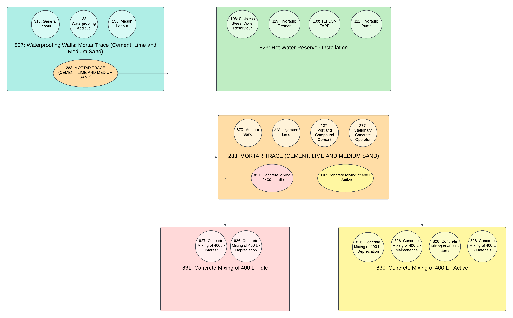
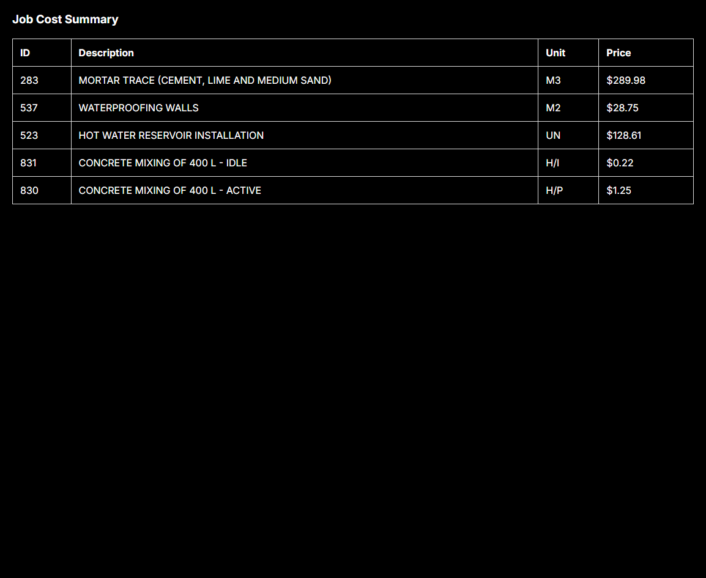

This is a [Next.js](https://nextjs.org/) project bootstrapped with [
`create-next-app`](https://github.com/vercel/next.js/tree/canary/packages/create-next-app).

### Get to know project tech stack

This simple project is a starting point for your take-home test. It is built with the following technologies:

- [React](https://reactjs.org/), a JavaScript library for building user interfaces
- [Next.js](https://nextjs.org/), a frontend framework for server-side rendering, easy routing, serverless RESTful API

### Getting started

#### 1. Clone the repository to your local machine:

```bash
 git clone https://github.com/your-repo-name/project.git
 cd project
```

#### 2. Install the dependencies:

```bash
npm install
```

### Running the Development Server:

Once everything above is configured, you can start the development server:

```bash
npm run dev
```

### Project Structure

- `src/`: Contains all source files.
- `components/`: Reusable UI components, including JobDataContainer.
- `helpers/`: Helper functions for data processing, such as buildJobHierarchyTree and calculateTotalCost.
- `tests/`: Jest unit test files organized similarly to the main files they test, ensuring modular and targeted testing.


The app should now be running, navigate to [`http://localhost:3000/`](http://localhost:3000/) in your browser to explore
its UI.

### Running the Automated Unit Test Suite with Jest:

To run the unit tests using Jest, use the following command in your terminal:

```bash
npm test
```

This will execute all the unit tests in the project. Upon successful execution, you should see an output similar to the
following:

```bash
> cbc-take-home@0.1.0 test
> jest

 PASS  src/app/__test__/app-helpers/helpers.test.ts
 PASS  src/app/__test__/job-data-collector-helpers/helpers.test.ts

Test Suites: 2 passed, 2 total
Tests:       15 passed, 15 total
Snapshots:   0 total
Time:        3.158 s, estimated 5 s
Ran all test suites.
```

- Test Suites: The number of test files that were executed and passed.
- Tests: The total number of individual test cases that were executed.
- Time: The total amount of time it took to run the automated test suite.

### Technical approach I used to tackle this problem:

For this project, the primary goal was to compute and display the total costs of each job from
composition-data.json within a user interface. My approach attempts to emphasize clean code organization,
a modular structure, and good test coverage.

### Understanding the Data Structure

The JSON data provided represents jobs in a nested, hierarchical format where each "job" can contain:

- `INPUT` Type Jobs: These entries represent resources needed for a job, such as materials like "TEFLON TAPE" or
  equipment like a "HYDRAULIC PUMP".
- `JOB` Type Jobs: These are sub-jobs or dependencies, representing tasks required to complete a larger job. For
  example, a job like "WATERPROOFING WALLS" includes multiple subtasks such as Mortar Trace, Concrete Mixing etc.

### Server Side Data Transformation: Building a Hierarchical Structure

To streamline processing, I created a helper function, `buildJobHierarchyTree()`, which transforms the JSON data into a
structured, tree-like format for each unique job. This function takes a parent job ID and recursively gathers all
related child jobs, organizing them hierarchically. The result is a nested structure where each job can have multiple
levels of sub-jobs, enabling accurate cost calculations and a clearer UI representation.

Although alternative approaches probably exist, such as using a more iterative method or directly leveraging the existing JSON
structure for all unique jobs and dependencies, I found this recursive approach of building individual job hierarchies
to be the most intuitive for me given the project's scope and requirements.

The resulting job hierarchy can be visualized in the following diagram:



This `buildJobHierarchyTree()` function returns an array of hierarchical job structures, which is then passed to the
main client component, JobDataContainer.

### Client side Cost Calculation

In the `JobDataContainer` client-side component, I developed a `calculateTotalCostForJob()`, a function to compute the
total costs of each
job, including their nested jobs. This function calculates costs by recursively summing up the costs of inputs and
sub-jobs:

1. **Input Cost Calculation:** `sumPricesForIndividualJobInput()` iterates over all "INPUT" type items for a job,
   calculating total costs based on pricePerUnit and jobItemQuantity.
2. **Recursive Cost Calculation for Nested Jobs**: `calculateTotalCost()` iterates through each nested job in the
   hierarchy, summing costs recursively for each job and its sub-jobs. Using `getJobItemQuantity()` as a helper, it
   ensures correct quantity-based cost calculations for sub-jobs of type "JOB".
3. **Output Structure**: The total cost of each job, along with its description and unit, is then used in the UI of the
   `JobDataContainer` client-side component to be displayed in a table format.

### Minor Bugs and Considerations

I identified a minor discrepancy in the app's total cost calculations for certain jobs. For example, in the provided
example PDF, the expected output for **HOT WATER RESERVOIR INSTALLATION** is `$128.60`, while my app calculates it as `$
128.61`. Similarly, for **MORTAR TRACE (CEMENT, LIME, AND MEDIUM SAND)**, the expected output
is `$289.97`, but my app shows `$289.98`. A difference of one cent in each case.

Given the scope and intent of this take-home project, I believe these minor discrepancies are not critical to
demonstrating the core functionality and logic of the app. While I plan to revisit and resolve these rounding issues in
the future, I’m prioritizing overall logic and functionality within the time constraints of this project.

### Screenshot of app running:


